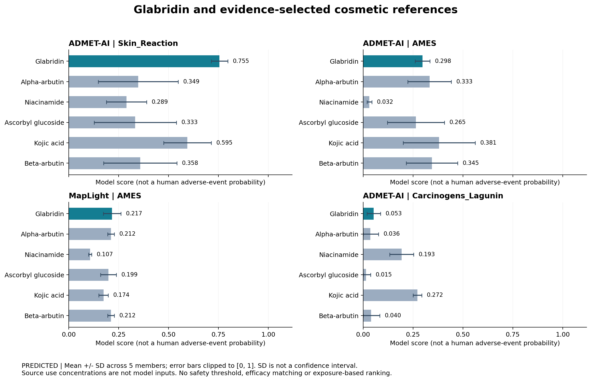

# 光甘草定护肤品参照成分与首次模型比较

参照组于 2026-09-29 根据公开安全资料、用途和结构确定，并在查看本轮预测前固定。保留全部入选成分。

**这些是有条件安全使用资料的参照原料，不是所有终点均为阴性的对照组。没有建立光甘草定的安全浓度或低风险阈值。**

## 入选资料与条件

| 成分 | 角色 | 资料支持范围 |
|---|---|---|
| α-熊果苷（Alpha-arbutin，CAS 84380-01-8） | PRIMARY_FUNCTIONAL_REFERENCE | SCCS 支持面霜不超过 2%、身体乳不超过 0.5% 的指定用途；需控制氢醌痕量。 [SCCS_ARBUTINS_2023](https://health.ec.europa.eu/publications/safety-alpha-arbutin-and-beta-arbutin-cosmetic-products_en)、[EU_2024_996](https://eur-lex.europa.eu/legal-content/EN/TXT/?uri=CELEX%3A32024R0996) |
| 烟酰胺（Niacinamide，CAS 98-92-0） | PRIMARY_FUNCTIONAL_REFERENCE | CIR 2005 支持所评估的化妆品用法；报告包含最高 5% 的人体刺激性试验。2% 和 5% 的色素研究提供用途参照，均不是通用安全上限。 [CIR_NIACINAMIDE_2005](https://pubmed.ncbi.nlm.nih.gov/16596767/)、[NIACINAMIDE_PIGMENT_2002](https://pubmed.ncbi.nlm.nih.gov/12100180/) |
| 抗坏血酸葡糖苷（Ascorbyl glucoside，CAS 129499-78-1） | SUPPORTING_ANTIOXIDANT_SKIN_CONDITIONING_REFERENCE | CIR 支持报告所述用法和浓度；非喷雾面颈产品报告用量最高 5%。该评估未覆盖以皮肤脱色为目的的使用。 [CIR_ASCORBYL_GLUCOSIDE_2020](https://www.cir-safety.org/sites/default/files/ascorb092020FR.pdf) |
| 曲酸（Kojic acid，CAS 501-30-4） | CONDITIONAL_FUNCTIONAL_REFERENCE | SCCS 最终意见支持不超过 1% 的指定美白用途；EU 2024/996 限面部和手部产品。皮肤屏障受损或去角质场景需额外关注。 [SCCS_KOJIC_2022](https://health.ec.europa.eu/publications/kojic-acid_en)、[EU_2024_996](https://eur-lex.europa.eu/legal-content/EN/TXT/?uri=CELEX%3A32024R0996) |
| β-熊果苷（Beta-arbutin，CAS 497-76-7） | EXTENDED_FUNCTIONAL_STEREOISOMER_REFERENCE | SCCS 支持面霜不超过 7% 的指定用途，并要求控制氢醌痕量；不能把 α/β 两者当作独立安全证据票数。 [SCCS_ARBUTINS_2023](https://health.ec.europa.eu/publications/safety-alpha-arbutin-and-beta-arbutin-cosmetic-products_en)、[EU_2024_996](https://eur-lex.europa.eu/legal-content/EN/TXT/?uri=CELEX%3A32024R0996) |

浓度含义必须区分：SCCS 的指定使用条件、EU 限制、CIR 报告的实际用量与单项试验浓度并不等价。EU 资料不代表已完成中国市场合规审核。抗坏血酸葡糖苷作为抗氧化/皮肤调理补充参照，其 CIR 结论不覆盖脱色用途。烟酰胺 2005 评估属于历史资料，不称为新近重评结果。

## 同模型、同终点的预测

| 成分 | ADMET-AI Skin_Reaction | ADMET-AI AMES | MapLight AMES | ADMET-AI Carcinogens_Lagunin |
|---|---:|---:|---:|---:|
| 光甘草定 | 0.755 ± 0.041 | 0.298 ± 0.037 | 0.217 ± 0.044 | 0.053 ± 0.034 |
| α-熊果苷 | 0.349 ± 0.200 | 0.333 ± 0.109 | 0.212 ± 0.017 | 0.036 ± 0.041 |
| 烟酰胺 | 0.289 ± 0.101 | 0.032 ± 0.012 | 0.107 ± 0.007 | 0.193 ± 0.060 |
| 抗坏血酸葡糖苷 | 0.333 ± 0.206 | 0.265 ± 0.143 | 0.199 ± 0.039 | 0.015 ± 0.023 |
| 曲酸 | 0.595 ± 0.119 | 0.381 ± 0.180 | 0.174 ± 0.023 | 0.272 ± 0.022 |
| β-熊果苷 | 0.358 ± 0.184 | 0.345 ± 0.129 | 0.212 ± 0.017 | 0.040 ± 0.043 |

数值为五成员均值 ± 标准差；不同列不能平均或互换。仅为结构预测，不含浓度、配方、经皮吸收和用量。不能将分数乘以浓度作为真实风险。

本轮 ADMET-AI Skin_Reaction：光甘草定 0.755，五种参照均值范围 0.289–0.595。该结果支持优先验证皮肤相关警示，不能建立整体安全优势，也不是人体不良反应发生率。

## 结果解释与证据缺口

- 光甘草定的既有皮肤/眼部等警示继续保留。某一模型分数低于参照物不构成整体更安全的结论。
- α/β-熊果苷保留独立立体结构。本轮 MapLight 特征完全相同、输出相同；ADMET-AI 并非完全相同。不能由此证明两种异构体生物效应相同，也不能作为两个独立支持票。
- 该小参照组不是外部校准数据集；未知训练成员身份不视作无重叠。
- 尚未为参照物运行 admetSAR、ADMETlab、VEGA 或 ProTox；尤其未完成参照组眼刺激/光毒性比较，缺失不记作阴性。
- 光甘草定使用浓度、成品配方、经皮吸收和等效功效条件缺失，尚不能完成实际风险排序。
- 需要另外建立带终点实验标签的阳性/阴性验证集，并核查训练集重叠与适用域。

### 已核查的 MapLight 数据集重叠

- {"model": "MapLight", "split": "train_val", "dataset_sha256": "8b3add847978ec60685541e07696c837f116b7cb245d44f86eb8f4f69da8e44d", "overlapping_ids_connectivity": ["niacinamide"]}
- {"model": "MapLight", "split": "test", "dataset_sha256": "d87e29ad1f188d6ee4fcdd5c3c3aa4ba15e4fec657553353d0d951ad8df02d3f", "overlapping_ids_connectivity": ["kojic_acid"]}
- {"model": "ADMET-AI", "training_membership": "NOT_AUDITED; do not treat this panel as independent validation"}

### 原始数据与复现

- [固定参照清单与来源](../../data/compounds/skincare_reference_panel.json)
- [全部 108 项模型输出](../../results/tables/skincare/reference_predictions.json)
- [540 项成员输出](../../data/raw/skincare/references/member_predictions.json)
- [运行元数据与校验和](../../data/raw/skincare/references/run_metadata.json)

Matvision：`python -m analysis.models.skincare_references --predict` 执行新推理；不带参数仅重建报告与图。既有五成员 MapLight AMES 检查点复用，不重新训练。ADMET-AI 提取同一组 17 个护肤任务；共享网络包含的其他输出不进入比较。
